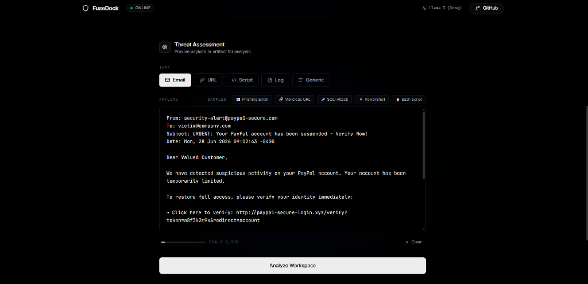
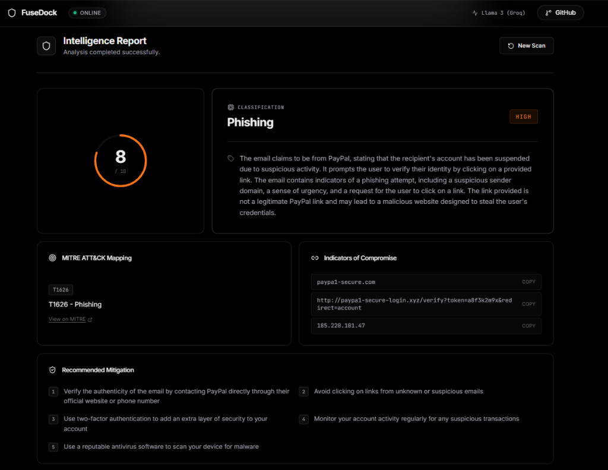
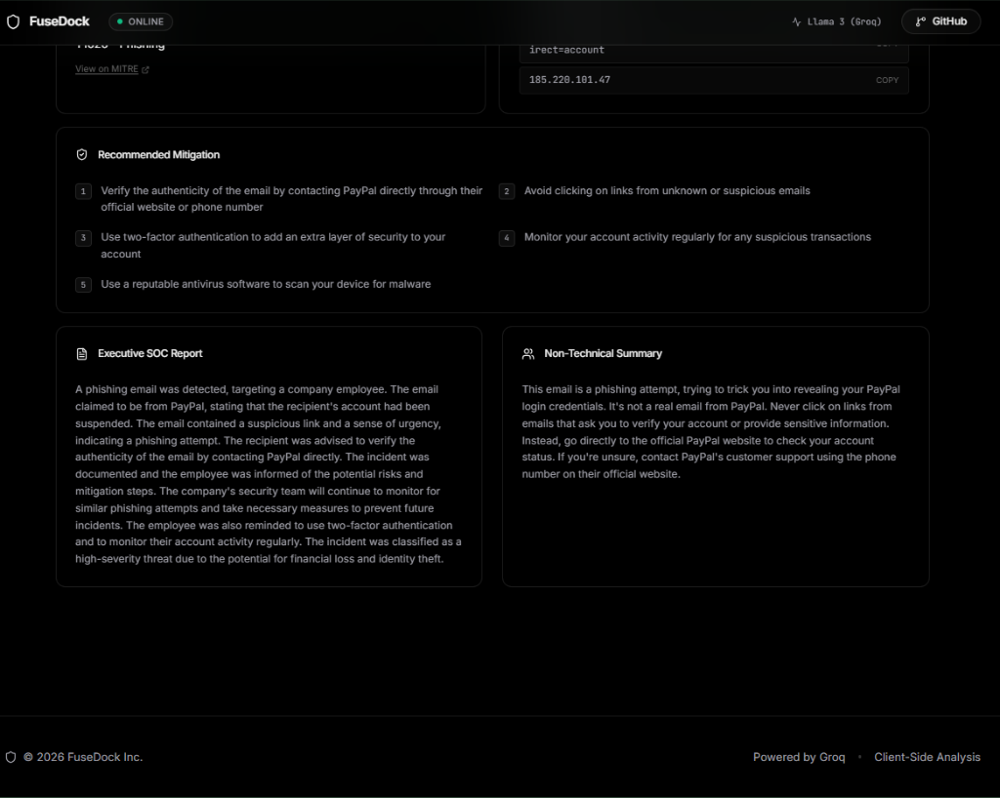
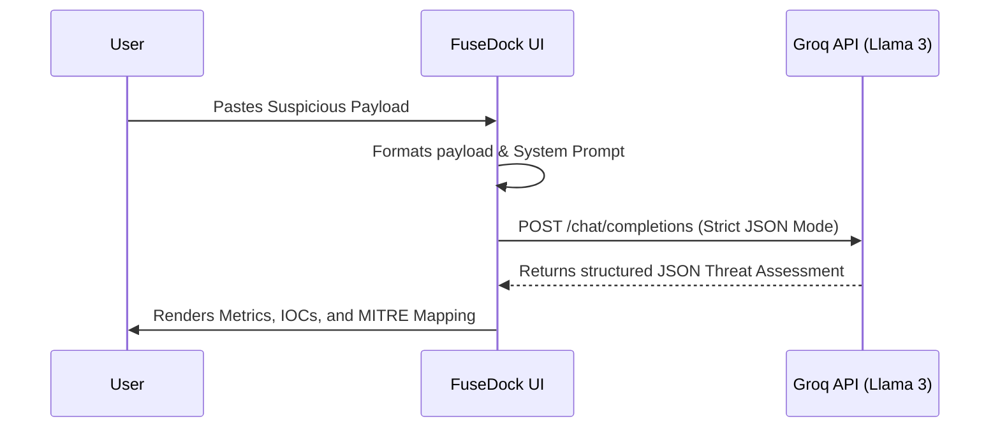

# 🛡️ FuseDock

<div align="center">
  <p><strong>Next-Generation SOC Triage & Threat Intelligence Workspace</strong></p>
  
  
  
  
  
  
</div>

## 🔗 Live Demo

**[https://fuse-dock.vercel.app/](https://fuse-dock.vercel.app/)**

## 📂 Repository

**[https://github.com/dakshpandey2102/fuseDock](https://github.com/dakshpandey2102/fuseDock)**

FuseDock is a blazing-fast, frontend-only cybersecurity triage workspace designed for modern Security Operations Centers (SOC). It empowers security analysts to instantly analyze suspicious emails, URLs, scripts, logs, and raw text to extract actionable threat intelligence.

---

## 📸 Application Preview

### Homepage


### Threat Assessment


### Intelligence Report


---

## ❓ Why FuseDock?

Security analysts are overwhelmed by alert fatigue and the manual process of parsing through suspicious artifacts. **FuseDock** solves this by:
- Eliminating the need for complex backend integrations for threat triage.
- Providing near-instantaneous analysis utilizing Llama 3 via Groq's high-speed inference.
- Structuring raw, unstructured threat data into a guaranteed, predictable JSON schema.
- Keeping analysis 100% client-side, ensuring that sensitive data isn't stored in persistent databases.

---

## ✨ Features

| Feature | Description |
| :--- | :--- |
| **⚡ Ultra-Fast Inference** | Powered by Groq's LPU architecture, delivering real-time AI threat analysis. |
| **🎯 Structured Data** | AI output is strictly engineered to return precise JSON schemas. |
| **🎨 Premium UI/UX** | Dark-mode, glassmorphism dashboard inspired by enterprise SOC tools. |
| **📊 Threat Metrics** | Generates 0-10 severity scores, MITRE ATT&CK mapping, and IOC extraction. |
| **🔒 100% Client-Side** | Zero backend or database; analysis occurs purely between the browser and Groq API. |

---

## 🏗️ Architecture



---

## 🛠️ Tech Stack

FuseDock is built with a modern, lightweight, and performant stack:
- **Core**: [React 18](https://react.dev/) + [Vite](https://vitejs.dev/)
- **Styling**: [Tailwind CSS v4](https://tailwindcss.com/)
- **Animation**: [Framer Motion](https://www.framer.com/motion/)
- **Icons**: [Lucide React](https://lucide.dev/)
- **Intelligence**: [Groq API](https://console.groq.com/) (Llama 3.3 70B Versatile)

---

## 🚀 Getting Started

### Prerequisites

- [Node.js](https://nodejs.org/) installed
- A free API key from [Groq](https://console.groq.com/keys)

### Installation

1. **Clone the repository**
   ```bash
   git clone https://github.com/dakshpandey2102/fuseDock.git
   cd fuseDock
   ```

2. **Install dependencies**
   ```bash
   npm install
   ```

3. **Configure Environment Variables**
   Create a `.env` file in the root of the project and add your Groq API key:
   ```env
   VITE_GROQ_API_KEY=gsk_your_groq_api_key_here
   ```

4. **Run the Development Server**
   ```bash
   npm run dev
   ```
   *The application will be available at `http://localhost:5174`.*

---

## 📁 Project Structure

```text
src/
├── components/
│   ├── layout/       # Navigation, sidebar, and wrappers
│   ├── input/        # Content entry and sample payload selectors
│   ├── results/      # Threat metrics, IOC grids, and MITRE cards
│   └── ui/           # Reusable micro-components (Loaders, Toasts)
├── hooks/
│   └── useGeminiAnalysis.js  # Main AI orchestration & retry logic
├── services/
│   └── geminiService.js      # Groq API integration (native fetch + backoff)
├── utils/
│   └── constants.js          # Static threat data and animations
├── App.jsx                   # Application shell
└── index.css                 # Tailwind entry and glassmorphism utilities
```

---

## ☁️ Deployment

FuseDock is a static frontend application, making it effortlessly deployable:

1. Push your repository to GitHub.
2. Import the project into a platform like [Vercel](https://vercel.com/) or Netlify.
3. Add `VITE_GROQ_API_KEY` to the platform's Environment Variables.
4. Deploy.

> [!WARNING]
> Because the API call happens in the browser, your Groq API key is exposed in the client bundle. For strict production environments, proxy the request through a serverless function.

---

## 📄 License

Distributed under the MIT License. See `LICENSE` for more information.
